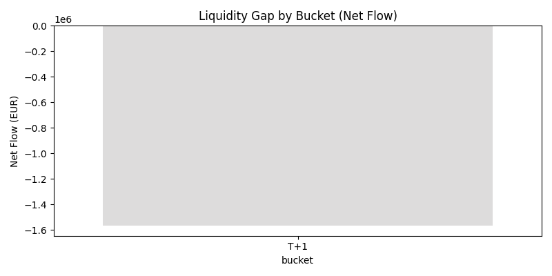
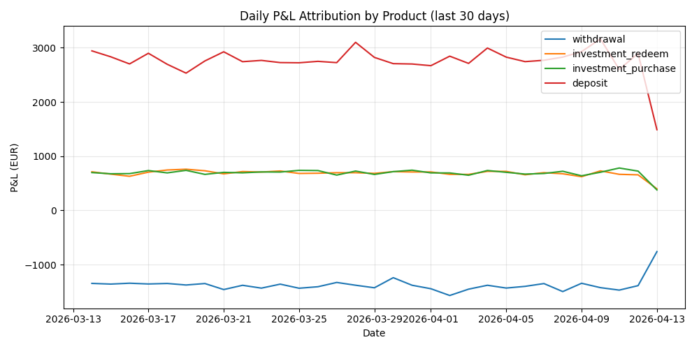
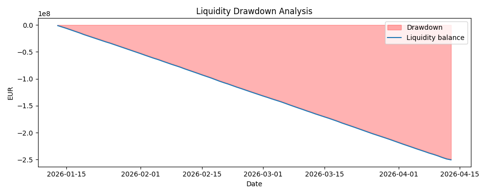

# Liquidity & Risk Analytics Pipeline (Fintech Simulation)
**Overview**
This project simulates a liquidity and risk analytics system similar to those used in modern fintech companies. It focuses on analyzing financial data to generate insights for treasury, risk management, and performance monitoring.

*The system processes transactional and market data to compute:*
- P&L attribution  
- Liquidity risk metrics  
- Behavioural patterns  
- Short-term investment performance  

## Relevance to Data Analyst Roles (Fintech)

This project was designed to reflect real-world responsibilities in a fintech data analytics environment, including:

* **ETL processes**: Extraction, transformation, and loading of transactional and market data
* **Data modeling**: Creation of aggregated views and tables to support efficient querying
* **Automated analytics**: Daily P&L attribution, liquidity risk reporting, and short-term investment performance tracking
* **Liquidity & behavioural analysis**: Cash flow patterns, deposit retention, and withdrawal clustering
* **Performance optimisation**: Query tuning, indexing strategies, and efficient data retrieval

The solution is built using **SQL (PostgreSQL)** and **Python (pandas, matplotlib)**, with a fully automated pipeline for reporting and analysis.

## Tech Stack
- Python (data pipeline orchestration, reporting)
- SQL (PostgreSQL) (data modeling, analytics, optimization)
- Pandas (data manipulation)
- Matplotlib / Plotly (visualizations)

**Business Context**
Financial institutions must continuously monitor liquidity and risk to ensure stability and profitability.

**Project Structure**
revolut_liquidity_project/
│
├── sql/                # Data modeling and analytics queries
├── python/             # Pipeline orchestration and reporting
├── outputs/            # Charts, reports, insights
├── README.md
└── requirements.txt

## Pipeline Workflow
1. **Data Preparation**
   - Synthetic financial data generation (transactions, positions)

2. **Data Modeling (SQL)**
   - Creation of raw tables
   - Aggregated views for analysis

3. **Analytics Layer**
   - P&L attribution
   - Liquidity gap analysis
   - Behavioural modelling
   - Investment performance

4. **Automation (Python)**
   - Executes SQL scripts
   - Generates reports and visualizations
   - Exports insights

## The pipeline generates:
- Charts (liquidity gaps, P&L trends)
- CSV reports (daily metrics)
- Insights summary (automatically generated)

## Key Insights
- Liquidity gaps increase significantly under stress scenarios  
- P&L is highly sensitive to volatility spikes  
- Withdrawal behaviour shows clustering patterns  
- Short-term investments perform better under stable market conditions  

## Outputs
### Liquidity Risk Analysis
Shows liquidity gaps across different time buckets.

### P&L Attribution by Product
Daily P&L contribution per product type.

### Liquidity Drawdown
Maximum decline from peak liquidity.

## How to Run
1. Install dependencies:
pip install -r requirements.txt
2. Configure database connection in:
python/connect_db.py
- Set up environment variables
Create a .env file in the root directory with your database credentials:
DB_NAME=your_database
DB_USER=your_user
DB_PASSWORD=your_password
DB_HOST=localhost
DB_PORT=5432

**Note: The .env file is not included in the repository for security reasons.**

3. Set up the database
Make sure your PostgreSQL database is running and properly configured.
4. Run the pipeline
python python/run_pipeline.py
